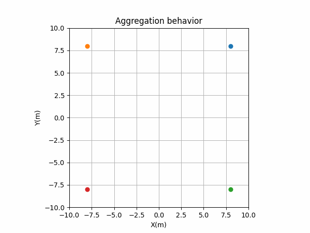

# pyswarming
[](https://github.com/mrsonandrade/pyswarming/actions/workflows/tests_package.yml)
[](https://www.repostatus.org/#active)
[](https://pyswarming.readthedocs.io/en/latest/?badge=latest)


`pyswarming` is a research toolkit for Swarm Robotics.


## Installation
You can install ``pyswarming`` from PyPI using pip (**Recommended**):
```
pip install pyswarming
```

## Dependencies

`pyswarming`'s dependencies are: `numpy`.


## Documentation
The official documentation is hosted on **[ReadTheDocs](https://pyswarming.readthedocs.io)**.

## Algorithms covered
This library includes the following algorithms to be used in swarm robotics:

- **Leaderless Coordination**: the collective performs heading consensus [^1];
- **Leader Following**: the collective performs heading consensus with a leader [^2];
- **Collision Avoidance**: the robot stay away from neighbors in the vicinity [^3];
- **Attraction and Alignment**: the robot become attracted and aligned [^3];
- **Preferred Direction**: the robot has preference to move toward a preset direction [^3];
- **Modified Attraction and Alignment**: the robot become attracted and aligned by considering a “social importance” factor [^4];
- **Heading Consensus**: the collective performs heading consensus [^5];
- **Perimeter Defense**: the robots maximize the perimeter covered in a an unknown environment [^5];
- **Environment Exploration**: the robots provide a spatial coverage [^5];
- **Aggregation**: makes all the individuals aggregate collectively [^6];
- **Alignment**: the collective performs heading consensus [^6];
- **Geofencing**: attract the robots towards the area A [^6];
- **Repulsion**: makes all the individuals repulse collectively [^6];
- **Target**: the robot goes to an specific target location [^6];

[^1]: Vicsek T, Czirók A, Ben-Jacob E, Cohen I, Shochet O. Novel Type of Phase Transition in a System of Self-Driven Particles. Phys Rev Lett 1995;75:1226–9. https://doi.org/10.1103/PhysRevLett.75.1226.

[^2]: Jadbabaie A, Jie Lin, Morse AS. Coordination of groups of mobile autonomous agents using nearest neighbor rules. IEEE Trans Automat Contr 2003;48:988–1001. https://doi.org/10.1109/TAC.2003.812781.

[^3]: Couzin ID, Krause J, Franks NR, Levin SA. Effective leadership and decision-making in animal groups on the move. Nature 2005;433:513–6. https://doi.org/10.1038/nature03236.

[^4]: Freeman R, Biro D. Modelling Group Navigation: Dominance and Democracy in Homing Pigeons. J Navigation 2009;62:33–40. https://doi.org/10.1017/S0373463308005080.

[^5]: Chamanbaz M, Mateo D, Zoss BM, Tokić G, Wilhelm E, Bouffanais R, et al. Swarm-Enabling Technology for Multi-Robot Systems. Front Robot AI 2017;4. https://doi.org/10.3389/frobt.2017.00012.

[^6]: Zoss BM, Mateo D, Kuan YK, Tokić G, Chamanbaz M, Goh L, et al. Distributed system of autonomous buoys for scalable deployment and monitoring of large waterbodies. Auton Robot 2018;42:1669–89. https://doi.org/10.1007/s10514-018-9702-0.

## Examples
Considering a swarm of robots, they can show different behaviors by using ``pyswarming``. The following codes are simplified implementations, for detailed ones, see the [Examples](https://github.com/mrsonandrade/pyswarming/tree/main/Examples) folder.
```python
# importing the swarming behaviors
import pyswarming.behaviors as ps

# importing numpy to work with arrays
import numpy as np
```


### Target 
To simplify, considering just one robot.
```python
# define the robot (x, y, z) position
r_i = np.asarray([0., 0., 0.])

# set the robot linear velocity
s_i = 1.0

# define a target (x, y, z) position
T = np.asarray([8., 8., 0.])

for t in range(15):

    # print the robot (x, y, z) position
    print(r_i)

    # update the robot (x, y, z) position
    r_i += s_i*ps.target(r_i, T)
```


### Aggregation 
Considering four robots.
```python
# define each robot (x, y, z) position
r = np.asarray([[8., 8., 0.],
                [-8., 8., 0.],
                [8., -8., 0.],
                [-8., -8., 0.]])

# set the robot linear velocity
s_i = 1.0

for t in range(15):

    # print the robot (x, y, z) positions
    print(r)

    # update the robot (x, y, z) positions
    for r_ind in range(len(r)):
        r_i = r[r_ind]
        r_j = np.delete(r, np.array([r_ind]), axis=0)
        r[r_ind] += s_i*ps.aggregation(r_i, r_j)
```



### Repulsion 
Considering four robots.
```python
# define each robot (x, y, z) position
r = np.asarray([[1., 1., 0.],
                [-1., 1., 0.],
                [1., -1., 0.],
                [-1., -1., 0.]])

# set the robot linear velocity
s_i = 1.0

for t in range(15):

    # print the robot (x, y, z) positions
    print(r)

    # update the robot (x, y, z) positions
    for r_ind in range(len(r)):
        r_i = r[r_ind]
        r_j = np.delete(r, np.array([r_ind]), axis=0)
        r[r_ind] += s_i*ps.repulsion(r_i, r_j, 3.0)
```


### Aggregation + Repulsion 
Considering four robots.
```python
# define each robot (x, y, z) position
r = np.asarray([[8., 8., 0.],
                [-8., 8., 0.],
                [8., -8., 0.],
                [-8., -8., 0.]])

# set the robot linear velocity
s_i = 1.0

for t in range(15):

    # print the robot (x, y, z) positions
    print(r)

    # update the robot (x, y, z) positions
    for r_ind in range(len(r)):
        r_i = r[r_ind]
        r_j = np.delete(r, np.array([r_ind]), axis=0)
        r[r_ind] += s_i*(ps.aggregation(r_i, r_j) + ps.repulsion(r_i, r_j, 5.0))
```


## Contributing to pyswarming
All kind of contributions are welcome: 
* Improvement of code with new features, bug fixes, and  bug reports
* Improvement of documentation
* Additional tests

Follow the instructions [here](https://pyswarming.readthedocs.io/en/latest/Contribution.html)
for submitting a PR.

If you have any ideas or questions, feel free to open an issue.


## Acknowledgements
This research is supported by CAPES (Coordination of Improvement of Higher Education Personnel), [LOC/COPPE/UFRJ](https://www.loc.ufrj.br/index.php/en/) ([Laboratory of Waves and Current](https://www.loc.ufrj.br/index.php/en/) - [Federal University of Rio de Janeiro](https://ufrj.br/en/)) and CNPq (Brazilian National Council for Scientific and Technological Development), which are gratefully acknowledged.
