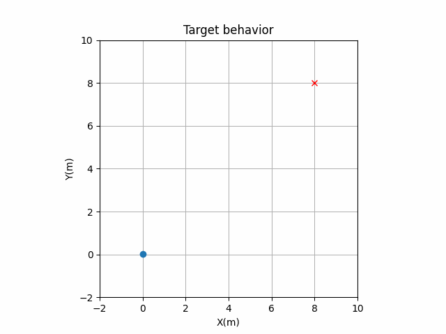

# pyswarming
[](https://github.com/mrsonandrade/pyswarming/actions/workflows/tests_package.yml)
[](https://www.repostatus.org/#active)
[](https://pyswarming.readthedocs.io/en/latest/?badge=latest)


`pyswarming` is a research toolkit for Swarm Robotics.


## Installation
You can install ``pyswarming`` from PyPI using pip (**Recommended**):
```
pip install pyswarming
```

## Dependencies

`pyswarming`'s dependencies are: `numpy`.


## Documentation
The official documentation is hosted on **[ReadTheDocs](https://pyswarming.readthedocs.io)**.

## Algorithms covered
This library includes the following algorithms to be used in swarm robotics:

- **Aggregation**: do this [^1];

[^1]: My reference.

## Examples
Considering a swarm of robots, they can show different behaviors by using ``pyswarming``. The following codes are simplified implementations, for detailed ones, see the [Examples](https://github.com/mrsonandrade/pyswarming/tree/main/Examples) folder.
```python
# importing the swarming behaviors
import pyswarming.behaviors as ps

# importing numpy to work with arrays
import numpy as np
```


### Target 
To simplify, considering just one robot.
```python
# define the robot (x, y, z) position
r_i = np.asarray([0., 0., 0.])

# set the robot linear velocity
s_i = 1.0

# define a target (x, y, z) position
T = np.asarray([8., 8., 0.])

for t in range(15):

    # print the robot (x, y, z) position
    print(r_i)

    # update the robot (x, y, z) position
    r_i += s_i*ps.target(r_i, T)
```



### Aggregation 
Considering four robots.
```python
# define each robot (x, y, z) position
r = np.asarray([[8., 8., 0.],
                [-8., 8., 0.],
                [8., -8., 0.],
                [-8., -8., 0.]])

# set the robot linear velocity
s_i = 1.0

for t in range(15):

    # print the robot (x, y, z) positions
    print(r)

    # update the robot (x, y, z) positions
    for r_ind in range(len(r)):
        r_i = r[r_ind]
        r_j = np.delete(r, np.array([r_ind]), axis=0)
        r[r_ind] += s_i*ps.aggregation(r_i, r_j)
```


### Repulsion 
Considering four robots.
```python
# define each robot (x, y, z) position
r = np.asarray([[1., 1., 0.],
                [-1., 1., 0.],
                [1., -1., 0.],
                [-1., -1., 0.]])

# set the robot linear velocity
s_i = 1.0

for t in range(15):

    # print the robot (x, y, z) positions
    print(r)

    # update the robot (x, y, z) positions
    for r_ind in range(len(r)):
        r_i = r[r_ind]
        r_j = np.delete(r, np.array([r_ind]), axis=0)
        r[r_ind] += s_i*ps.repulsion(r_i, r_j, 3.0)
```


### Aggregation + Repulsion 
Considering four robots.
```python
# define each robot (x, y, z) position
r = np.asarray([[8., 8., 0.],
                [-8., 8., 0.],
                [8., -8., 0.],
                [-8., -8., 0.]])

# set the robot linear velocity
s_i = 1.0

for t in range(15):

    # print the robot (x, y, z) positions
    print(r)

    # update the robot (x, y, z) positions
    for r_ind in range(len(r)):
        r_i = r[r_ind]
        r_j = np.delete(r, np.array([r_ind]), axis=0)
        r[r_ind] += s_i*(ps.aggregation(r_i, r_j) + ps.repulsion(r_i, r_j, 5.0))
```


## Contributing to pyswarming
All kind of contributions are welcome: 
* Improvement of code with new features, bug fixes, and  bug reports
* Improvement of documentation
* Additional tests

Follow the instructions [here](https://pyswarming.readthedocs.io/en/latest/Contribution.html)
for submitting a PR.

If you have any ideas or questions, feel free to open an issue.


## Acknowledgements
This research is supported by CAPES (Coordination of Improvement of Higher Education Personnel), [LOC/COPPE/UFRJ](https://www.loc.ufrj.br/index.php/en/) ([Laboratory of Waves and Current](https://www.loc.ufrj.br/index.php/en/) - [Federal University of Rio de Janeiro](https://ufrj.br/en/)) and CNPq (Brazilian National Council for Scientific and Technological Development), which are gratefully acknowledged.
